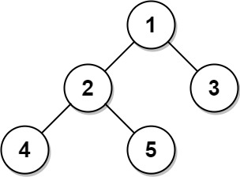
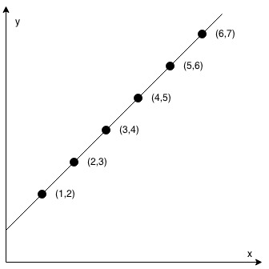
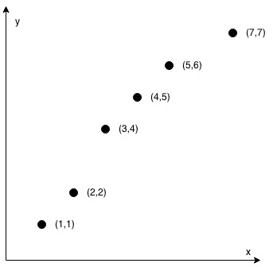

# Problem No. 1
    Given an array of integers nums and an integer target, return indices of the two numbers such that they add up to target.

    You may assume that each input would have exactly one solution, and you may not use the same element twice.

    You can return the answer in any order.

## Example 1:

    Input: nums = [2,7,11,15], target = 9
    Output: [0,1]
    Explanation: Because nums[0] + nums[1] == 9, we return [0, 1].

## Example 2:

    Input: nums = [3,2,4], target = 6
    Output: [1,2]

## Example 3:

    Input: nums = [3,3], target = 6
    Output: [0,1]

 
 

# Problem  No. 9
     Given an integer x, return true if x is a palindrome, and false otherwise.

## Example 1:

    Input: x = 121
    Output: true
    Explanation: 121 reads as 121 from left to right and from right to left.

## Example 2:

    Input: x = 122
    Output: false
    Explanation: 122 reads as 122 from left to right and 221 from right to left.

 
 

# Problem No. 35
    Given a sorted array of distinct integers and a target value, return the index if the target is found. If not, return the index where it would be if it were inserted in order.

    You must write an algorithm with O(log n) runtime complexity.

## Example 1:

    Input: nums = [1,3,5,6], target = 5
    Output: 2

## Example 2:

    Input: nums = [1,3,5,6], target = 2
    Output: 1

## Example 3:

    Input: nums = [1,3,5,6], target = 7
    Output: 4

 
 

# Problem No. 53
     Given an integer array nums, find the subarray with the largest sum, and return its sum

## Example 1:

    Input: nums = [-2,1,-3,4,-1,2,1,-5,4]
    Output: 6
    Explanation: The subarray [4,-1,2,1] has the largest sum 6.

## Example 2:

    Input: nums = [1]
    Output: 1
    Explanation: The subarray [1] has the largest sum 1.

## Example 3:

    Input: nums = [5,4,-1,7,8]
    Output: 23
    Explanation: The subarray [5,4,-1,7,8] has the largest sum 23.

 
 

# Problem No. 175

# Table
    Person:
            +-------------+---------+
            | Column Name | Type    |
            +-------------+---------+
            | personId    | int     |
            | lastName    | varchar |
            | firstName   | varchar |
            +-------------+---------+

    personId is the primary key column for this table.
    This table contains information about the ID of some persons and their first and last names.

    Address:
            +-------------+---------+
            | Column Name | Type    |
            +-------------+---------+
            | addressId   | int     |
            | personId    | int     |
            | city        | varchar |
            | state       | varchar |
            +-------------+---------+

    addressId is the primary key column for this table.
    Each row of this table contains information about the city and state of one person with ID = PersonId.
 

    Write an SQL query to report the first name, last name, city, and state of each person in the Person table. If the address of a personId is not present in the Address table, report null instead.
    Return the result table in any order.

## Example 1:

    Input: 

        Person :
                +----------+----------+-----------+
                | personId | lastName | firstName |
                +----------+----------+-----------+
                | 1        | Wang     | Allen     |
                | 2        | Alice    | Bob       |
                +----------+----------+-----------+

        Address :
                +-----------+----------+---------------+------------+
                | addressId | personId | city          | state      |
                +-----------+----------+---------------+------------+
                | 1         | 2        | New York City | New York   |
                | 2         | 3        | Leetcode      | California |
                +-----------+----------+---------------+------------+

    Output:
            +-----------+----------+---------------+----------+
            | firstName | lastName | city          | state    |
            +-----------+----------+---------------+----------+
            | Allen     | Wang     | Null          | Null     |
            | Bob       | Alice    | New York City | New York |
            +-----------+----------+---------------+----------+
    

    Explanation: There is no address in the address table for the personId = 1 so we return null in their city and state.
                 addressId = 1 contains information about the address of personId = 2.

 
 

# Problem No. 176

# Table
    Employee:
            +-------------+------+
            | Column Name | Type |
            +-------------+------+
            | id          | int  |
            | salary      | int  |
            +-------------+------+

            id is the primary key column for this table.
            Each row of this table contains information about the salary of an employee.

 

    Write an SQL query to report the second highest salary from the Employee table. If there is no second highest salary, the query should report null.

## Example 1:

    Input: 

        Employee:
                +----+--------+
                | id | salary |
                +----+--------+
                | 1  | 100    |
                | 2  | 200    |
                | 3  | 300    |
                +----+--------+

    Output:
            +---------------------+
            | SecondHighestSalary |
            +---------------------+
            | 200                 |
            +---------------------+

## Example 2:

    Input: 

        Employee:
                +----+--------+
                | id | salary |
                +----+--------+
                | 1  | 100    |
                +----+--------+

    Output:
            +---------------------+
            | SecondHighestSalary |
            +---------------------+
            | null                |
            +---------------------+

 
 

# Problem No. 182

# Table
    Person:
            +-------------+---------+
            | Column Name | Type    |
            +-------------+---------+
            | id          | int     |
            | email       | varchar |
            +-------------+---------+

    id is the primary key column for this table.
    Each row of this table contains an email. The emails will not contain uppercase letters.

 

    Write an SQL query to report all the duplicate emails.
    Return the result table in any order.

## Example 1:

    Input: 

        Person table:
            +----+---------+
            | id | email   |
            +----+---------+
            | 1  | a@b.com |
            | 2  | c@d.com |
            | 3  | a@b.com |
            +----+---------+

    Output:
            +---------+
            | Email   |
            +---------+
            | a@b.com |
            +---------+

    Explanation: a@b.com is repeated two times.

 
 

#   Problem No. 183

# Table
    Customers:
                +-------------+---------+
                | Column Name | Type    |
                +-------------+---------+
                | id          | int     |
                | name        | varchar |
                +-------------+---------+

    id is the primary key column for this table.
    Each row of this table indicates the ID and name of a customer.

    Orders:
                +-------------+------+
                | Column Name | Type |
                +-------------+------+
                | id          | int  |
                | customerId  | int  |
                +-------------+------+

    id is the primary key column for this table.
    customerId is a foreign key of the ID from the Customers table.
    Each row of this table indicates the ID of an order and the ID of the customer who ordered it.

 

    Write an SQL query to report all customers who never order anything.
    Return the result table in any order.

## Example 1:

    Input: 

        Customers table:
                        +----+-------+
                        | id | name  |
                        +----+-------+
                        | 1  | Joe   |
                        | 2  | Henry |
                        | 3  | Sam   |
                        | 4  | Max   |
                        +----+-------+
        Orders table:
                        +----+------------+
                        | id | customerId |
                        +----+------------+
                        | 1  | 3          |
                        | 2  | 1          |
                        +----+------------+

    Output:
            +-----------+
            | Customers |
            +-----------+
            | Henry     |
            | Max       |
            +-----------+

 
 

# Problem No. 191
    Write a function that takes an unsigned integer and returns the number of '1' bits it has (also known as the Hamming weight).

_Note:_
-   Note that in some languages, such as Java, there is no unsigned integer type. In this case, the input will be given as a signed integer type. It should not affect your implementation, as the integer's internal binary representation is the same, whether it is signed or unsigned.

-   In Java, the compiler represents the signed integers using 2's complement notation. Therefore, in Example 3, the input represents the signed integer. -3.

## Example 1:

    Input: n = 00000000000000000000000000001011
    Output: 3
    Explanation: The input binary string 00000000000000000000000000001011 has a total of three '1' bits.

## Example 2:

    Input: n = 00000000000000000000000010000000
    Output: 1
    Explaination: The input binary string 00000000000000000000000010000000 has a total of one '1' bit.

## Example 3:

    Input: n = 11111111111111111111111111111101
    Output: 31
    Explaination: The input binary string 11111111111111111111111111111101 has a total of thirty one '1' bits.

 
 

# Problem No. 196

# Table
    Person :
            +-------------+---------+
            | Column Name | Type    |
            +-------------+---------+
            | id          | int     |
            | email       | varchar |
            +-------------+---------+

    id is the primary key column for this table.
    Each row of this table contains an email. The emails will not contain uppercase letters.

 

    Write an SQL query to delete all the duplicate emails, keeping only one unique email with the smallest id. Note that you are supposed to write a DELETE statement and not a SELECT one.

    After running your script, the answer shown is the Person table. The driver will first compile and run your piece of code and then show the Person table. The final order of the Person table does not matter.

## Example 1:

    Input: 

        Person table:
            +----+------------------+
            | id | email            |
            +----+------------------+
            | 1  | john@example.com |
            | 2  | bob@example.com  |
            | 3  | john@example.com |
            +----+------------------+

    Output:
            +----+------------------+
            | id | email            |
            +----+------------------+
            | 1  | john@example.com |
            | 2  | bob@example.com  |
            +----+------------------+

    Explanation: john@example.com is repeated two times. We keep the row with the smallest Id = 1.

 
 

# Problem No. 197

# Table
    Weather:
            +---------------+---------+
            | Column Name   | Type    |
            +---------------+---------+
            | id            | int     |
            | recordDate    | date    |
            | temperature   | int     |
            +---------------+---------+

    id is the primary key for this table.
    This table contains information about the temperature on a certain day.

 

    Write an SQL query to find all dates' Id with higher temperatures compared to its previous dates (yesterday).
    Return the result table in any order.

## Example 1:

    Input: 

        Weather:
            +----+------------+-------------+
            | id | recordDate | temperature |
            +----+------------+-------------+
            | 1  | 2015-01-01 | 10          |
            | 2  | 2015-01-02 | 25          |
            | 3  | 2015-01-03 | 20          |
            | 4  | 2015-01-04 | 30          |
            +----+------------+-------------+

    Output:
            +----+
            | id |
            +----+
            | 2  |
            | 4  |
            +----+

    Explanation: In 2015-01-02, the temperature was higher than the previous day (10 -> 25).
                 In 2015-01-04, the temperature was higher than the previous day (20 -> 30).

 
 

# Problem No. 202
     Write an algorithm to determine if a number n is happy.

A happy number is a number defined by the following process:

-   Starting with any positive integer, replace the number by the sum of the squares of its digits.
-   Repeat the process until the number equals 1 (where it will stay), or it loops endlessly in a cycle which does not include 1.
-   Those numbers for which this process ends in 1 are happy.

_Return true if n is a happy number, and false if not._

## Example 1:

    Input: n = 19
    Output: true
    Explanation: 1^2 + 9^2 = 82
                 8^2 + 2^2 = 68
                 6^2 + 8^2 = 100
                 1^2 + 0^2 + 0^2 = 1

## Example 2:

    Input: n = 2
    Output: false

 
 

# Problem No. 217
    Given an integer array nums, return true if any value appears at least twice in the array, and return false if every element is distinct.

## Example 1:

    Input: nums = [1,2,3,1]
    Output: true

## Example 2:

    Input: nums = [1,2,3,4]
    Output: false

## Example 3:

    Input: nums = [1,1,1,3,3,4,3,2,4,2]
    Output: true

 
 

# Problem No. 258
     Given an integer num, repeatedly add all its digits until the result has only one digit, and return it.

## Example 1:

    Input: num = 38
    Output: 2
    Explanation: The process is
                        38 --> 3 + 8 --> 11
                        11 --> 1 + 1 --> 2
                 Since 2 has only one digit, return it.

## Example 2:

    Input: num = 0
    Output: 0

 
 

# Problem No. 511

# Table
    Activity:
            +--------------+---------+
            | Column Name  | Type    |
            +--------------+---------+
            | player_id    | int     |
            | device_id    | int     |
            | event_date   | date    |
            | games_played | int     |
            +--------------+---------+

    (player_id, event_date) is the primary key of this table.
    This table shows the activity of players of some games.
    Each row is a record of a player who logged in and played a number of games (possibly 0) before logging out on someday using some device.

 

    Write an SQL query to report the first login date for each player.
    Return the result table in any order.

## Example 1:

    Input: 

        Activity table:
            +-----------+-----------+------------+--------------+
            | player_id | device_id | event_date | games_played |
            +-----------+-----------+------------+--------------+
            | 1         | 2         | 2016-03-01 | 5            |
            | 1         | 2         | 2016-05-02 | 6            |
            | 2         | 3         | 2017-06-25 | 1            |
            | 3         | 1         | 2016-03-02 | 0            |
            | 3         | 4         | 2018-07-03 | 5            |
            +-----------+-----------+------------+--------------+

    Output:
            +-----------+-------------+
            | player_id | first_login |
            +-----------+-------------+
            | 1         | 2016-03-01  |
            | 2         | 2017-06-25  |
            | 3         | 2016-03-02  |
            +-----------+-------------+

 
 

# Problem No. 584

# Table
    Customer:
                +-------------+---------+
                | Column Name | Type    |
                +-------------+---------+
                | id          | int     |
                | name        | varchar |
                | referee_id  | int     |
                +-------------+---------+

    id is the primary key column for this table.
    Each row of this table indicates the id of a customer, their name, and the id of the customer who referred them.

 

    Write an SQL query to report the names of the customer that are not referred by the customer with id = 2.

    Return the result table in any order.

## Example 1:

    Input: 

        Customer table:
            +----+------+------------+
            | id | name | referee_id |
            +----+------+------------+
            | 1  | Will | null       |
            | 2  | Jane | null       |
            | 3  | Alex | 2          |
            | 4  | Bill | null       |
            | 5  | Zack | 1          |
            | 6  | Mark | 2          |
            +----+------+------------+

    Output:
            +------+
            | name |
            +------+
            | Will |
            | Jane |
            | Bill |
            | Zack |
            +------+

 
 

# Problem No. 586

# Table
    Orders:
            +-----------------+----------+
            | Column Name     | Type     |
            +-----------------+----------+
            | order_number    | int      |
            | customer_number | int      |
            +-----------------+----------+

    order_number is the primary key for this table.
    This table contains information about the order ID and the customer ID.

 

    Write an SQL query to find the customer_number for the customer who has placed the largest number of orders.
    The test cases are generated so that exactly one customer will have placed more orders than any other customer.

## Example 1:

    Input: 

        Orders:
            +--------------+-----------------+
            | order_number | customer_number |
            +--------------+-----------------+
            | 1            | 1               |
            | 2            | 2               |
            | 3            | 3               |
            | 4            | 3               |
            +--------------+-----------------+

    Output:
            +-----------------+
            | customer_number |
            +-----------------+
            | 3               |
            +-----------------+

    Explanation: The customer with number 3 has two orders, which is greater than either customer 1 or 2 because each of them only has one order. 
                 So, the result is customer_number 3.

 
 

# Problem No. 595

# Table
    World:
            +-------------+---------+
            | Column Name | Type    |
            +-------------+---------+
            | name        | varchar |
            | continent   | varchar |
            | area        | int     |
            | population  | int     |
            | gdp         | int     |
            +-------------+---------+

    name is the primary key column for this table.
    Each row of this table gives information about the name of a country, the continent to which it belongs, its area, the population, and its GDP value.

 

_A country is big :_

-   If it has an area of at least three million (i.e., 3000000 km2), or
-   If it has a population of at least twenty-five million (i.e., 25000000).

Write an SQL query to report the name, population, and area of the big countries. Return the result table in any order.

## Example 1:

    Input: 

        World table:
            +-------------+-----------+---------+------------+--------------+
            | name        | continent | area    | population | gdp          |
            +-------------+-----------+---------+------------+--------------+
            | Afghanistan | Asia      | 652230  | 25500100   | 20343000000  |
            | Albania     | Europe    | 28748   | 2831741    | 12960000000  |
            | Algeria     | Africa    | 2381741 | 37100000   | 188681000000 |
            | Andorra     | Europe    | 468     | 78115      | 3712000000   |
            | Angola      | Africa    | 1246700 | 20609294   | 100990000000 |
            +-------------+-----------+---------+------------+--------------+

    Output:
            +-------------+------------+---------+
            | name        | population | area    |
            +-------------+------------+---------+
            | Afghanistan | 25500100   | 652230  |
            | Algeria     | 37100000   | 2381741 |
            +-------------+------------+---------+

 
 

# Problem No. 607

# Table

    SalesPerson: 
                +-----------------+---------+
                | Column Name     | Type    |
                +-----------------+---------+
                | sales_id        | int     |
                | name            | varchar |
                | salary          | int     |
                | commission_rate | int     |
                | hire_date       | date    |
                +-----------------+---------+

    sales_id is the primary key column for this table.
    Each row of this table indicates the name and the ID of a salesperson alongside their salary, commission rate, and hire date.

    Company:
                +-------------+---------+
                | Column Name | Type    |
                +-------------+---------+
                | com_id      | int     |
                | name        | varchar |
                | city        | varchar |
                +-------------+---------+

    com_id is the primary key column for this table.
    Each row of this table indicates the name and the ID of a company and the city in which the company is located.

    Orders:
                +-------------+------+
                | Column Name | Type |
                +-------------+------+
                | order_id    | int  |
                | order_date  | date |
                | com_id      | int  |
                | sales_id    | int  |
                | amount      | int  |
                +-------------+------+

    order_id is the primary key column for this table.
    com_id is a foreign key to com_id from the Company table.
    sales_id is a foreign key to sales_id from the SalesPerson table.
    Each row of this table contains information about one order. This includes the ID of the company, the ID of the salesperson, the date of the order, and the amount paid.

 

    Write an SQL query to report the names of all the salespersons who did not have any orders related to the company with the name "RED".
    Return the result table in any order.

## Example 1:

    Input: 

        SalesPerson:
            +----------+------+--------+-----------------+------------+
            | sales_id | name | salary | commission_rate | hire_date  |
            +----------+------+--------+-----------------+------------+
            | 1        | John | 100000 | 6               | 4/1/2006   |
            | 2        | Amy  | 12000  | 5               | 5/1/2010   |
            | 3        | Mark | 65000  | 12              | 12/25/2008 |
            | 4        | Pam  | 25000  | 25              | 1/1/2005   |
            | 5        | Alex | 5000   | 10              | 2/3/2007   |
            +----------+------+--------+-----------------+------------+

        Company:
            +--------+--------+----------+
            | com_id | name   | city     |
            +--------+--------+----------+
            | 1      | RED    | Boston   |
            | 2      | ORANGE | New York |
            | 3      | YELLOW | Boston   |
            | 4      | GREEN  | Austin   |
            +--------+--------+----------+

        Orders:
            +----------+------------+--------+----------+--------+
            | order_id | order_date | com_id | sales_id | amount |
            +----------+------------+--------+----------+--------+
            | 1        | 1/1/2014   | 3      | 4        | 10000  |
            | 2        | 2/1/2014   | 4      | 5        | 5000   |
            | 3        | 3/1/2014   | 1      | 1        | 50000  |
            | 4        | 4/1/2014   | 1      | 4        | 25000  |
            +----------+------------+--------+----------+--------+
    

    Output:
            +------+
            | name |
            +------+
            | Amy  |
            | Mark |
            | Alex |
            +------+

    Explanation: According to orders 3 and 4 in the Orders table, it is easy to tell that only salesperson John and Pam have sales to company RED, so we report all the other names in the table salesperson.

 
 

# Problem No. 608

# Table
    Tree:
            +-------------+------+
            | Column Name | Type |
            +-------------+------+
            | id          | int  |
            | p_id        | int  |
            +-------------+------+

            id is the primary key column for this table.
            Each row of this table contains information about the id of a node and the id of its parent node in a tree.
            The given structure is always a valid tree.

 

Each node in the tree can be one of three types:

- "Leaf": if the node is a leaf node.
- "Root": if the node is the root of the tree.
- "Inner": If the node is neither a leaf node nor a root node.

 

    Write an SQL query to report the type of each node in the tree.
    Return the result table in any order.

## Example 1:

    Input: 

        Tree:
                +----+------+
                | id | p_id |
                +----+------+
                | 1  | null |
                | 2  | 1    |
                | 3  | 1    |
                | 4  | 2    |
                | 5  | 2    |
                +----+------+

    Output:
            +----+-------+
            | id | type  |
            +----+-------+
            | 1  | Root  |
            | 2  | Inner |
            | 3  | Leaf  |
            | 4  | Leaf  |
            | 5  | Leaf  |
            +----+-------+

    Explanation: Node 1 is the root node because its parent node is null and it has child nodes 2 and 3.
                 Node 2 is an inner node because it has parent node 1 and child node 4 and 5.
                 Nodes 3, 4, and 5 are leaf nodes because they have parent nodes and they do not have child nodes.

## Example 2:

    Input: 

        Tree:
                +----+------+
                | id | p_id |
                +----+------+
                | 1  | null |
                +----+------+

    Output:
            +----+-------+
            | id | type  |
            +----+-------+
            | 1  | Root  |
            +----+-------+

    Explanation: If there is only one node on the tree, you only need to output its root attributes.

 
 

# Problem No. 627

# Table
    Salary
            +-------------+----------+
            | Column Name | Type     |
            +-------------+----------+
            | id          | int      |
            | name        | varchar  |
            | sex         | ENUM     |
            | salary      | int      |
            +-------------+----------+

    id is the primary key for this table.
    The sex column is ENUM value of type ('m', 'f').
    The table contains information about an employee.

 

    Write an SQL query to swap all 'f' and 'm' values (i.e., change all 'f' values to 'm' and vice versa) with a single update statement and no intermediate temporary tables.

_Note that you must write a single update statement, do not write any select statement for this problem._

## Example 1:

    Input: 

        Salary table:
            +----+------+-----+--------+
            | id | name | sex | salary |
            +----+------+-----+--------+
            | 1  | A    | m   | 2500   |
            | 2  | B    | f   | 1500   |
            | 3  | C    | m   | 5500   |
            | 4  | D    | f   | 500    |
            +----+------+-----+--------+

    Output:
            +----+------+-----+--------+
            | id | name | sex | salary |
            +----+------+-----+--------+
            | 1  | A    | f   | 2500   |
            | 2  | B    | m   | 1500   |
            | 3  | C    | f   | 5500   |
            | 4  | D    | m   | 500    |
            +----+------+-----+--------+

    Explanation: (1, A) and (3, C) were changed from 'm' to 'f'.
                 (2, B) and (4, D) were changed from 'f' to 'm'.

 
 

# Problem No. 771
    You're given strings jewels representing the types of stones that are jewels, and stones representing the stones you have. Each character in stones is a type of stone you have. You want to know how many of the stones you have are also jewels.

    Letters are case sensitive, so "a" is considered a different type of stone from "A".

## Example 1:

    Input: jewels = "aA", stones = "aAAbbbb"
    Output: 3

## Example 2:

    Input: jewels = "z", stones = "ZZ"
    Output: 0

 
 

# Problem No. 832
    Given an n x n binary matrix image, flip the image horizontally, then invert it, and return the resulting image.
 

    To flip an image horizontally means that each row of the image is reversed.
-   For example, flipping [1,1,0] horizontally results in [0,1,1].

 

    To invert an image means that each 0 is replaced by 1, and each 1 is replaced by 0.

-   For example, inverting [0,1,1] results in [1,0,0].

## Example 1:

    Input: image = [[1,1,0],[1,0,1],[0,0,0]]
    Output: [[1,0,0],[0,1,0],[1,1,1]]
    Explanation: First reverse each row: [[0,1,1],[1,0,1],[0,0,0]].
                 Then, invert the image: [[1,0,0],[0,1,0],[1,1,1]]

## Example 2:

    Input: image = [[1,1,0,0],[1,0,0,1],[0,1,1,1],[1,0,1,0]]
    Output: [[1,1,0,0],[0,1,1,0],[0,0,0,1],[1,0,1,0]]
    Explanation: First reverse each row: [[0,0,1,1],[1,0,0,1],[1,1,1,0],[0,1,0,1]].
                 Then, invert the image: [[1,1,0,0],[0,1,1,0],[0,0,0,1],[1,0,1,0]]

 
 

# Problem No. 976
     Given an integer array nums, return the largest perimeter of a triangle with a non-zero area, formed from three of these lengths. If it is impossible to form any triangle of a non-zero area, return 0.

## Example 1:

    Input: nums = [2,1,2]
    Output: 5
    Explanation: You can form a triangle with three side lengths: 1, 2, and 2.

## Example 2:

    Input: nums = [1,2,1,10]
    Output: 0
    Explanation: You cannot use the side lengths 1, 1, and 2 to form a triangle.
                 You cannot use the side lengths 1, 1, and 10 to form a triangle.
                 You cannot use the side lengths 1, 2, and 10 to form a triangle.
                 As we cannot use any three side lengths to form a triangle of non-zero area, we return 0.

 
 

# Problem No. 1050

# Table
    ActorDirector:
                +-------------+---------+
                | Column Name | Type    |
                +-------------+---------+
                | actor_id    | int     |
                | director_id | int     |
                | timestamp   | int     |
                +-------------+---------+
    timestamp is the primary key column for this table.

 

    Write a SQL query for a report that provides the pairs (actor_id, director_id) where the actor has cooperated with the director at least three times.
    Return the result table in any order.

## Example 1:

    Input: 

        ActorDirector:
            +-------------+-------------+-------------+
            | actor_id    | director_id | timestamp   |
            +-------------+-------------+-------------+
            | 1           | 1           | 0           |
            | 1           | 1           | 1           |
            | 1           | 1           | 2           |
            | 1           | 2           | 3           |
            | 1           | 2           | 4           |
            | 2           | 1           | 5           |
            | 2           | 1           | 6           |
            +-------------+-------------+-------------+

    Output:
            +-------------+-------------+
            | actor_id    | director_id |
            +-------------+-------------+
            | 1           | 1           |
            +-------------+-------------+

    Explanation: The only pair is (1, 1) where they cooperated exactly 3 times.

 
 

# Problem No. 1084

# Table

    Product: 
                +--------------+---------+
                | Column Name  | Type    |
                +--------------+---------+
                | product_id   | int     |
                | product_name | varchar |
                | unit_price   | int     |
                +--------------+---------+

    product_id is the primary key of this table.
    Each row of this table indicates the name and the price of each product.

    Sales:
                +-------------+---------+
                | Column Name | Type    |
                +-------------+---------+
                | seller_id   | int     |
                | product_id  | int     |
                | buyer_id    | int     |
                | sale_date   | date    |
                | quantity    | int     |
                | price       | int     |
                +-------------+---------+

    This table has no primary key, it can have repeated rows.
    product_id is a foreign key to the Product table.
    Each row of this table contains some information about one sale.

 

    Write an SQL query that reports the products that were only sold in the first quarter of 2019. That is, between 2019-01-01 and 2019-03-31 inclusive.
    Return the result table in any order.

## Example 1:

    Input: 

        Product table:
            +------------+--------------+------------+
            | product_id | product_name | unit_price |
            +------------+--------------+------------+
            | 1          | S8           | 1000       |
            | 2          | G4           | 800        |
            | 3          | iPhone       | 1400       |
            +------------+--------------+------------+

        Sales table:
            +-----------+------------+----------+------------+----------+-------+
            | seller_id | product_id | buyer_id | sale_date  | quantity | price |
            +-----------+------------+----------+------------+----------+-------+
            | 1         | 1          | 1        | 2019-01-21 | 2        | 2000  |
            | 1         | 2          | 2        | 2019-02-17 | 1        | 800   |
            | 2         | 2          | 3        | 2019-06-02 | 1        | 800   |
            | 3         | 3          | 4        | 2019-05-13 | 2        | 2800  |
            +-----------+------------+----------+------------+----------+-------+

    

    Output:
            +-------------+--------------+
            | product_id  | product_name |
            +-------------+--------------+
            | 1           | S8           |
            +-------------+--------------+

    Explanation: The product with id 1 was only sold in the spring of 2019.
                 The product with id 2 was sold in the spring of 2019 but was also sold after the spring of 2019.
                 The product with id 3 was sold after spring 2019.
                 We return only product 1 as it is the product that was only sold in the spring of 2019.

 
 

# Problem No. 1141

# Table

    Activity:
                +---------------+---------+
                | Column Name   | Type    |
                +---------------+---------+
                | user_id       | int     |
                | session_id    | int     |
                | activity_date | date    |
                | activity_type | enum    |
                +---------------+---------+
                
    There is no primary key for this table, it may have duplicate rows.
    The activity_type column is an ENUM of type ('open_session', 'end_session', 'scroll_down', 'send_message').
    The table shows the user activities for a social media website.
    Note that each session belongs to exactly one user.

 

    Write an SQL query to find the daily active user count for a period of 30 days ending 2019-07-27 inclusively. A user was active on someday if they made at least one activity on that day.
    Return the result table in any order.

## Example 1:

    Input: 

        Activity table:
            +---------+------------+---------------+---------------+
            | user_id | session_id | activity_date | activity_type |
            +---------+------------+---------------+---------------+
            | 1       | 1          | 2019-07-20    | open_session  |
            | 1       | 1          | 2019-07-20    | scroll_down   |
            | 1       | 1          | 2019-07-20    | end_session   |
            | 2       | 4          | 2019-07-20    | open_session  |
            | 2       | 4          | 2019-07-21    | send_message  |
            | 2       | 4          | 2019-07-21    | end_session   |
            | 3       | 2          | 2019-07-21    | open_session  |
            | 3       | 2          | 2019-07-21    | send_message  |
            | 3       | 2          | 2019-07-21    | end_session   |
            | 4       | 3          | 2019-06-25    | open_session  |
            | 4       | 3          | 2019-06-25    | end_session   |
            +---------+------------+---------------+---------------+
    

    Output:
            +------------+--------------+ 
            | day        | active_users |
            +------------+--------------+
            | 2019-07-20 | 2            |
            | 2019-07-21 | 2            |
            +------------+--------------+

    Explanation: Note that we do not care about days with zero active users.

 
 

# Problem No. 1148

# Table
    Views:
            +---------------+---------+
            | Column Name   | Type    |
            +---------------+---------+
            | article_id    | int     |
            | author_id     | int     |
            | viewer_id     | int     |
            | view_date     | date    |
            +---------------+---------+

    There is no primary key for this table, it may have duplicate rows.
    Each row of this table indicates that some viewer viewed an article (written by some author) on some date.
    Note that equal author_id and viewer_id indicate the same person.

 

    Write an SQL query to find all the authors that viewed at least one of their own articles.

    Return the result table sorted by id in ascending order.

## Example 1:

    Input: 

        Views table:
            +------------+-----------+-----------+------------+
            | article_id | author_id | viewer_id | view_date  |
            +------------+-----------+-----------+------------+
            | 1          | 3         | 5         | 2019-08-01 |
            | 1          | 3         | 6         | 2019-08-02 |
            | 2          | 7         | 7         | 2019-08-01 |
            | 2          | 7         | 6         | 2019-08-02 |
            | 4          | 7         | 1         | 2019-07-22 |
            | 3          | 4         | 4         | 2019-07-21 |
            | 3          | 4         | 4         | 2019-07-21 |
            +------------+-----------+-----------+------------+

    Output:
            +------+
            | id   |
            +------+
            | 4    |
            | 7    |
            +------+

 
 

# Problem No. 1158

# Table

    Users: 
                +----------------+---------+
                | Column Name    | Type    |
                +----------------+---------+
                | user_id        | int     |
                | join_date      | date    |
                | favorite_brand | varchar |
                +----------------+---------+

    user_id is the primary key of this table.
    This table has the info of the users of an online shopping website where users can sell and buy items.

    Orders:
                +---------------+---------+
                | Column Name   | Type    |
                +---------------+---------+
                | order_id      | int     |
                | order_date    | date    |
                | item_id       | int     |
                | buyer_id      | int     |
                | seller_id     | int     |
                +---------------+---------+

    order_id is the primary key of this table.
    item_id is a foreign key to the Items table.
    buyer_id and seller_id are foreign keys to the Users table.

    Items:

                +---------------+---------+
                | Column Name   | Type    |
                +---------------+---------+
                | item_id       | int     |
                | item_brand    | varchar |
                +---------------+---------+
                
    item_id is the primary key of this table.

 

    Write an SQL query to find for each user, the join date and the number of orders they made as a buyer in 2019.
    Return the result table in any order.

## Example 1:

    Input: 

        Users table:
            +---------+------------+----------------+
            | user_id | join_date  | favorite_brand |
            +---------+------------+----------------+
            | 1       | 2018-01-01 | Lenovo         |
            | 2       | 2018-02-09 | Samsung        |
            | 3       | 2018-01-19 | LG             |
            | 4       | 2018-05-21 | HP             |
            +---------+------------+----------------+

        Orders table:
            +----------+------------+---------+----------+-----------+
            | order_id | order_date | item_id | buyer_id | seller_id |
            +----------+------------+---------+----------+-----------+
            | 1        | 2019-08-01 | 4       | 1        | 2         |
            | 2        | 2018-08-02 | 2       | 1        | 3         |
            | 3        | 2019-08-03 | 3       | 2        | 3         |
            | 4        | 2018-08-04 | 1       | 4        | 2         |
            | 5        | 2018-08-04 | 1       | 3        | 4         |
            | 6        | 2019-08-05 | 2       | 2        | 4         |
            +----------+------------+---------+----------+-----------+

        
        Items table:
            +---------+------------+
            | item_id | item_brand |
            +---------+------------+
            | 1       | Samsung    |
            | 2       | Lenovo     |
            | 3       | LG         |
            | 4       | HP         |
            +---------+------------+
    

    Output:
            +-----------+------------+----------------+
            | buyer_id  | join_date  | orders_in_2019 |
            +-----------+------------+----------------+
            | 1         | 2018-01-01 | 1              |
            | 2         | 2018-02-09 | 2              |
            | 3         | 2018-01-19 | 0              |
            | 4         | 2018-05-21 | 0              |
            +-----------+------------+----------------+

 
 

# Problem No. 1232
    You are given an array coordinates, coordinates[i] = [x, y], where [x, y] represents the coordinate of a point.
    Check if these points make a straight line in the XY plane.

## Example 1:

    Input: coordinates = [[1,2],[2,3],[3,4],[4,5],[5,6],[6,7]]
    Output: true

## Example 2:

    Input: coordinates = [[1,1],[2,2],[3,4],[4,5],[5,6],[7,7]]
    Output: false

 
 

# Problem No. 1281
    Given an integer number n, return the difference between the product of its digits and the sum of its digits.

## Example 1:

    Input: n = 234
    Output: 15
    Explanation: Product of digits = 2 * 3 * 4 = 24 
                 Sum of digits = 2 + 3 + 4 = 9
                 Result = 24 - 9 = 15

## Example 2:

    Input: n = 4421
    Output: 21
    Explanation: Product of digits = 4 * 4 * 2 * 1 = 32
                 Sum of digits = 4 + 4 + 2 + 1 = 11
                 Result = 32 - 11 = 21

 
 

# Problem No. 1393

# Table

    Stocks: 
            +---------------+---------+
            | Column Name   | Type    |
            +---------------+---------+
            | stock_name    | varchar |
            | operation     | enum    |
            | operation_day | int     |
            | price         | int     |
            +---------------+---------+

    (stock_name, operation_day) is the primary key for this table.
    The operation column is an ENUM of type ('Sell', 'Buy')
    Each row of this table indicates that the stock which has stock_name had an operation on the day operation_day with the price.
    It is guaranteed that each 'Sell' operation for a stock has a corresponding 'Buy' operation in a previous day. It is also guaranteed that each 'Buy' operation for a stock has a corresponding 'Sell' operation in an upcoming day.

 

    Write an SQL query to report the Capital gain/loss for each stock.
    The Capital gain/loss of a stock is the total gain or loss after buying and selling the stock one or many times.
    Return the result table in any order.

## Example 1:

    Input: 

        Stocks table:
            +---------------+-----------+---------------+--------+
            | stock_name    | operation | operation_day | price  |
            +---------------+-----------+---------------+--------+
            | Leetcode      | Buy       | 1             | 1000   |
            | Corona Masks  | Buy       | 2             | 10     |
            | Leetcode      | Sell      | 5             | 9000   |
            | Handbags      | Buy       | 17            | 30000  |
            | Corona Masks  | Sell      | 3             | 1010   |
            | Corona Masks  | Buy       | 4             | 1000   |
            | Corona Masks  | Sell      | 5             | 500    |
            | Corona Masks  | Buy       | 6             | 1000   |
            | Handbags      | Sell      | 29            | 7000   |
            | Corona Masks  | Sell      | 10            | 10000  |
            +---------------+-----------+---------------+--------+

    

    Output:
            +---------------+-------------------+
            | stock_name    | capital_gain_loss |
            +---------------+-------------------+
            | Corona Masks  | 9500              |
            | Leetcode      | 8000              |
            | Handbags      | -23000            |
            +---------------+-------------------+

    Explanation: Leetcode stock was bought at day 1 for 1000$ and was sold at day 5 for 9000$. Capital gain = 9000 - 1000 = 8000$.
                 Handbags stock was bought at day 17 for 30000$ and was sold at day 29 for 7000$. Capital loss = 7000 - 30000 = -23000$.
                 Corona Masks stock was bought at day 1 for 10$ and was sold at day 3 for 1010$. It was bought again at day 4 for 1000$ and was sold at day 5 for 500$. 
                 At last, it was bought at day 6 for 1000$ and was sold at day 10 for 10000$. Capital gain/loss is the sum of capital gains/losses for each ('Buy' --> 'Sell') operation = (1010 - 10) + (500 - 1000) + (10000 - 1000) = 1000 - 500 + 9000 = 9500$.

 
 

# Problem No. 1407

# Table

    Users: 
                +---------------+---------+
                | Column Name   | Type    |
                +---------------+---------+
                | id            | int     |
                | name          | varchar |
                +---------------+---------+

    id is the primary key for this table.
    name is the name of the user.

    Rides:
                +---------------+---------+
                | Column Name   | Type    |
                +---------------+---------+
                | id            | int     |
                | user_id       | int     |
                | distance      | int     |
                +---------------+---------+

    id is the primary key for this table.
    user_id is the id of the user who traveled the distance "distance".

 

    Write an SQL query to report the distance traveled by each user.
    Return the result table ordered by travelled_distance in descending order, if two or more users traveled the same distance, order them by their name in ascending order.

## Example 1:

    Input: 

        Users table:
            +------+-----------+
            | id   | name      |
            +------+-----------+
            | 1    | Alice     |
            | 2    | Bob       |
            | 3    | Alex      |
            | 4    | Donald    |
            | 7    | Lee       |
            | 13   | Jonathan  |
            | 19   | Elvis     |
            +------+-----------+

        Rides table:
            +------+----------+----------+
            | id   | user_id  | distance |
            +------+----------+----------+
            | 1    | 1        | 120      |
            | 2    | 2        | 317      |
            | 3    | 3        | 222      |
            | 4    | 7        | 100      |
            | 5    | 13       | 312      |
            | 6    | 19       | 50       |
            | 7    | 7        | 120      |
            | 8    | 19       | 400      |
            | 9    | 7        | 230      |
            +------+----------+----------+

    

    Output:
            +----------+--------------------+
            | name     | travelled_distance |
            +----------+--------------------+
            | Elvis    | 450                |
            | Lee      | 450                |
            | Bob      | 317                |
            | Jonathan | 312                |
            | Alex     | 222                |
            | Alice    | 120                |
            | Donald   | 0                  |
            +----------+--------------------+

    Explanation: Elvis and Lee traveled 450 miles, Elvis is the top traveler as his name is alphabetically smaller than Lee.
                 Bob, Jonathan, Alex, and Alice have only one ride and we just order them by the total distances of the ride.
                 Donald did not have any rides, the distance traveled by him is 0.

 
 

# Problem No. 1470
     Given the array nums consisting of 2n elements in the form [x1,x2,...,xn,y1,y2,...,yn].

_Return the array in the form [x1,y1,x2,y2,...,xn,yn]._

## Example 1:

    Input: nums = [2,5,1,3,4,7], n = 3
    Output: [2,3,5,4,1,7]
    Explanation: Since x1=2, x2=5, x3=1, y1=3, y2=4, y3=7 then the answer is [2,3,5,4,1,7].

## Example 2:

    Input: nums = [1,2,3,4,4,3,2,1], n = 4
    Output: [1,4,2,3,3,2,4,1]

## Example 3:

    Input: nums = [1,1,2,2], n = 2
    Output: [1,2,1,2]

 
 

# Problem No. 1480
     Given an array nums. We define a running sum of an array as runningSum[i] = sum(nums[0]nums[i]). Return the running sum of nums.

## Example 1:

    Input: nums = [1,2,3,4]
    Output: [1,3,6,10]
    Explanation: Running sum is obtained as follows: [1, 1+2, 1+2+3, 1+2+3+4].

## Example 2:

    Input: nums = [1,1,1,1,1]
    Output: [1,2,3,4,5]
    Explanation: Running sum is obtained as follows: [1, 1+1, 1+1+1, 1+1+1+1, 1+1+1+1+1].

 
 

# Problem No. 1484

# Table
    Activities:
                +-------------+---------+
                | Column Name | Type    |
                +-------------+---------+
                | sell_date   | date    |
                | product     | varchar |
                +-------------+---------+

    There is no primary key for this table, it may contain duplicates.
    Each row of this table contains the product name and the date it was sold in a market.

 

    Write an SQL query to find for each date the number of different products sold and their names.
    The sold products names for each date should be sorted lexicographically.
    Return the result table ordered by sell_date.

## Example 1:

    Input: 

        Activities table:
            +------------+------------+
            | sell_date  | product     |
            +------------+------------+
            | 2020-05-30 | Headphone  |
            | 2020-06-01 | Pencil     |
            | 2020-06-02 | Mask       |
            | 2020-05-30 | Basketball |
            | 2020-06-01 | Bible      |
            | 2020-06-02 | Mask       |
            | 2020-05-30 | T-Shirt    |
            +------------+------------+

    Output:
            +------------+----------+------------------------------+
            | sell_date  | num_sold | products                     |
            +------------+----------+------------------------------+
            | 2020-05-30 | 3        | Basketball,Headphone,T-shirt |
            | 2020-06-01 | 2        | Bible,Pencil                 |
            | 2020-06-02 | 1        | Mask                         |
            +------------+----------+------------------------------+

    Explanation: For 2020-05-30, Sold items were (Headphone, Basketball, T-shirt), we sort them lexicographically and separate them by a comma.
                 For 2020-06-01, Sold items were (Pencil, Bible), we sort them lexicographically and separate them by a comma.
                 For 2020-06-02, the Sold item is (Mask), we just return it.

 
 

# Problem No. 1491
    You are given an array of unique integers salary where salary[i] is the salary of the ith employee.

    Return the average salary of employees excluding the minimum and maximum salary.

## Example 1:

    Input: salary = [4000,3000,1000,2000]
    Output: 2500.00000
    Explanation: Minimum salary and maximum salary are 1000 and 4000 respectively.
                 Average salary excluding minimum and maximum salary is (2000+3000) / 2 = 2500

## Example 2:

    Input: salary = [1000,2000,3000]
    Output: 2000.00000
    Explanation: Minimum salary and maximum salary are 1000 and 3000 respectively.
                 Average salary excluding minimum and maximum salary is (2000) / 1 = 2000

 
 

# Problem No. 1502
    A sequence of numbers is called an arithmetic progression if the difference between any two consecutive elements is the same.

    Given an array of numbers arr, return true if the array can be rearranged to form an arithmetic progression. Otherwise, return false.

## Example 1:

    Input: arr = [3,5,1]
    Output: true
    Explanation: We can reorder the elements as [1,3,5] or [5,3,1] with differences 2 and -2 respectively, between each consecutive elements.

## Example 2:

    Input: arr = [1,2,4]
    Output: false
    Explanation: There is no way to reorder the elements to obtain an arithmetic progression.

 
 

# Problem No. 1512
    Given an array of integers nums, return the number of good pairs.

    A pair (i, j) is called good if nums[i] == nums[j] and i < j.

## Example 1:

    Input: nums = [1,2,3,1,1,3]
    Output: 4
    Explanation: There are 4 good pairs (0,3), (0,4), (3,4), (2,5) 0-indexed.

## Example 2:

    Input: nums = [1,1,1,1]
    Output: 6
    Explanation: Each pair in the array are good.

## Example 3:

    Input: nums = [1,2,3]
    Output: 0

 
 

# Problem No. 1523
    Given two non-negative integers low and high. Return the count of odd numbers between low and high (inclusive).

## Example 1:

    Input: low = 3, high = 7
    Output: 3
    Explanation: The odd numbers between 3 and 7 are [3,5,7]

## Example 2:

    Input: low = 8, high = 10
    Output: 1
    Explanation: The odd numbers between 8 and 10 are [9]

 
 

# Problem No. 1527

# Table
    Patients:
                +--------------+---------+
                | Column Name  | Type    |
                +--------------+---------+
                | patient_id   | int     |
                | patient_name | varchar |
                | conditions   | varchar |
                +--------------+---------+

    patient_id is the primary key for this table.
    'conditions' contains 0 or more code separated by spaces.
    This table contains information of the patients in the hospital.

 

    Write an SQL query to report the patient_id, patient_name and conditions of the patients who have Type I Diabetes. Type I Diabetes always starts with DIAB1 prefix.
    Return the result table in any order.

## Example 1:

    Input: 

        Patients table:
            +------------+--------------+--------------+
            | patient_id | patient_name | conditions   |
            +------------+--------------+--------------+
            | 1          | Daniel       | YFEV COUGH   |
            | 2          | Alice        |              |
            | 3          | Bob          | DIAB100 MYOP |
            | 4          | George       | ACNE DIAB100 |
            | 5          | Alain        | DIAB201      |
            +------------+--------------+--------------+

    Output:
            +------------+--------------+--------------+
            | patient_id | patient_name | conditions   |
            +------------+--------------+--------------+
            | 3          | Bob          | DIAB100 MYOP |
            | 4          | George       | ACNE DIAB100 |
            +------------+--------------+--------------+

    Explanation: Bob and George both have a condition that starts with DIAB1.

 
 

# Problem No. 1581

# Table
    Visits:
            +-------------+---------+
            | Column Name | Type    |
            +-------------+---------+
            | visit_id    | int     |
            | customer_id | int     |
            +-------------+---------+

    visit_id is the primary key for this table.
    This table contains information about the customers who visited the mall.

    Transactions:
                +----------------+---------+
                | Column Name    | Type    |
                +----------------+---------+
                | transaction_id | int     |
                | visit_id       | int     |
                | amount         | int     |
                +----------------+---------+

    transaction_id is the primary key for this table.
    This table contains information about the transactions made during the visit_id.

 

    Write a SQL query to find the IDs of the users who visited without making any transactions and the number of times they made these types of visits.
    Return the result table sorted in any order.

## Example 1:

    Input: 

        Visits:
                +----------+-------------+
                | visit_id | customer_id |
                +----------+-------------+
                | 1        | 23          |
                | 2        | 9           |
                | 4        | 30          |
                | 5        | 54          |
                | 6        | 96          |
                | 7        | 54          |
                | 8        | 54          |
                +----------+-------------+

        Transactions:
                +----------------+----------+--------+
                | transaction_id | visit_id | amount |
                +----------------+----------+--------+
                | 2              | 5        | 310    |
                | 3              | 5        | 300    |
                | 9              | 5        | 200    |
                | 12             | 1        | 910    |
                | 13             | 2        | 970    |
                +----------------+----------+--------+

    Output:
            +-------------+----------------+
            | customer_id | count_no_trans |
            +-------------+----------------+
            | 54          | 2              |
            | 30          | 1              |
            | 96          | 1              |
            +-------------+----------------+

    Explanation: Customer with id = 23 visited the mall once and made one transaction during the visit with id = 12.
                 Customer with id = 9 visited the mall once and made one transaction during the visit with id = 13.
                 Customer with id = 30 visited the mall once and did not make any transactions.
                 Customer with id = 54 visited the mall three times. During 2 visits they did not make any transactions, and during one visit they made 3 transactions.
                 Customer with id = 96 visited the mall once and did not make any transactions.
                 
                 As we can see, users with IDs 30 and 96 visited the mall one time without making any transactions. Also, user 54 visited the mall twice and did not make any transactions.

 
 

# Problem No. 1588
    Given an array of positive integers arr, return the sum of all possible odd-length subarrays of arr.

    A subarray is a contiguous subsequence of the array.

## Example 1:

    Input: arr = [1,4,2,5,3]
    Output: 58
    Explanation: The odd-length subarrays of arr and their sums are:
                    
                    [1] = 1
                    [4] = 4
                    [2] = 2
                    [5] = 5
                    [3] = 3
                    [1,4,2] = 7
                    [4,2,5] = 11
                    [2,5,3] = 10
                    [1,4,2,5,3] = 15

                 If we add all these together we get 1 + 4 + 2 + 5 + 3 + 7 + 11 + 10 + 15 = 58

## Example 2:

    Input: arr = [1,2]
    Output: 3
    Explanation: There are only 2 subarrays of odd length, [1] and [2]. Their sum is 3.

## Example 3:

    Input: arr = [10,11,12]
    Output: 66

 
 

# Problem No. 1667

# Table
    Users:
            +----------------+---------+
            | Column Name    | Type    |
            +----------------+---------+
            | user_id        | int     |
            | name           | varchar |
            +----------------+---------+

    user_id is the primary key for this table.
    This table contains the ID and the name of the user.
    The name consists of only lowercase and uppercase characters.

 

    Write an SQL query to fix the names so that only the first character is uppercase and the rest are lowercase.
    Return the result table ordered by user_id.

## Example 1:

    Input: 

        Users table:
            +---------+-------+
            | user_id | name  |
            +---------+-------+
            | 1       | aLice |
            | 2       | bOB   |
            +---------+-------+

    Output:
            +---------+-------+
            | user_id | name  |
            +---------+-------+
            | 1       | Alice |
            | 2       | Bob   |
            +---------+-------+

 
 

# Problem No. 1741

# Table
    Employees:
                +-------------+------+
                | Column Name | Type |
                +-------------+------+
                | emp_id      | int  |
                | event_day   | date |
                | in_time     | int  |
                | out_time    | int  |
                +-------------+------+

    (emp_id, event_day, in_time) is the primary key of this table.
    The table shows the employees' entries and exits in an office.
    event_day is the day at which this event happened, in_time is the minute at which the employee entered the office, and out_time is the minute at which they left the office.
    in_time and out_time are between 1 and 1440.
    It is guaranteed that no two events on the same day intersect in time, and in_time < out_time.

 

    Write an SQL query to calculate the total time in minutes spent by each employee on each day at the office. Note that within one day, an employee can enter and leave more than once. The time spent in the office for a single entry is out_time - in_time.

    Return the result table in any order.

## Example 1:

    Input: 

        Employees table:
            +--------+------------+---------+----------+
            | emp_id | event_day  | in_time | out_time |
            +--------+------------+---------+----------+
            | 1      | 2020-11-28 | 4       | 32       |
            | 1      | 2020-11-28 | 55      | 200      |
            | 1      | 2020-12-03 | 1       | 42       |
            | 2      | 2020-11-28 | 3       | 33       |
            | 2      | 2020-12-09 | 47      | 74       |
            +--------+------------+---------+----------+

    Output:
            +------------+--------+------------+
            | day        | emp_id | total_time |
            +------------+--------+------------+
            | 2020-11-28 | 1      | 173        |
            | 2020-11-28 | 2      | 30         |
            | 2020-12-03 | 1      | 41         |
            | 2020-12-09 | 2      | 27         |
            +------------+--------+------------+

    Explanation: Employee 1 has three events: two on day 2020-11-28 with a total of (32 - 4) + (200 - 55) = 173, and one on day 2020-12-03 with a total of (42 - 1) = 41.
                 Employee 2 has two events: one on day 2020-11-28 with a total of (33 - 3) = 30, and one on day 2020-12-09 with a total of (74 - 47) = 27.

 
 

# Problem No. 1757

# Table
    Products: 
            +-------------+---------+
            | Column Name | Type    |
            +-------------+---------+
            | product_id  | int     |
            | low_fats    | enum    |
            | recyclable  | enum    |
            +-------------+---------+

    product_id is the primary key for this table.
    low_fats is an ENUM of type ('Y', 'N') where 'Y' means this product is low fat and 'N' means it is not.
    recyclable is an ENUM of types ('Y', 'N') where 'Y' means this product is recyclable and 'N' means it is not.

 

    Write an SQL query to find the ids of products that are both low fat and recyclable.
    Return the result table in any order.

## Example 1:

    Input: 

        Products table:
            +-------------+----------+------------+
            | product_id  | low_fats | recyclable |
            +-------------+----------+------------+
            | 0           | Y        | N          |
            | 1           | Y        | Y          |
            | 2           | N        | Y          |
            | 3           | Y        | Y          |
            | 4           | N        | N          |
            +-------------+----------+------------+

    Output:
            +-------------+
            | product_id  |
            +-------------+
            | 1           |
            | 3           |
            +-------------+

    Explanation: Only products 1 and 3 are both low fat and recyclable.

 
 

# Problem No. 1795

# Table
    Products:
            +-------------+---------+
            | Column Name | Type    |
            +-------------+---------+
            | product_id  | int     |
            | store1      | int     |
            | store2      | int     |
            | store3      | int     |
            +-------------+---------+

    product_id is the primary key for this table.
    Each row in this table indicates the product's price in 3 different stores: store1, store2, and store3.
    If the product is not available in a store, the price will be null in that store's column.

 

    Write an SQL query to rearrange the Products table so that each row has (product_id, store, price). If a product is not available in a store, do not include a row with that product_id and store combination in the result table.
    Return the result table in any order.

## Example 1:

    Input: 

        Products table:
            +------------+--------+--------+--------+
            | product_id | store1 | store2 | store3 |
            +------------+--------+--------+--------+
            | 0          | 95     | 100    | 105    |
            | 1          | 70     | null   | 80     |
            +------------+--------+--------+--------+

    Output:
            +------------+--------+-------+
            | product_id | store  | price |
            +------------+--------+-------+
            | 0          | store1 | 95    |
            | 0          | store2 | 100   |
            | 0          | store3 | 105   |
            | 1          | store1 | 70    |
            | 1          | store3 | 80    |
            +------------+--------+-------+

    Explanation: Product 0 is available in all three stores with prices 95, 100, and 105 respectively.
                 Product 1 is available in store1 with price 70 and store3 with price 80. The product is not available in store2.

 
 

# Problem No. 1822
    There is a function signFunc(x) that returns:

-   1 if x is positive.
-   -1 if x is negative.
- 0 if x is equal to 0.

You are given an integer array nums. Let product be the product of all values in the array nums.

Return signFunc(product).

## Example 1:

    Input: nums = [-1,-2,-3,-4,3,2,1]
    Output: 1
    Explanation: The product of all values in the array is 144, and signFunc(144) = 1

## Example 2:

    Input: nums = [1,5,0,2,-3]
    Output: 0
    Explanation: The product of all values in the array is 0, and signFunc(0) = 0

## Example 3:

    Input: nums = [-1,1,-1,1,-1]
    Output: -1
    Explanation: The product of all values in the array is -1, and signFunc(-1) = -1

 
 

# Problem No. 1873

# Table
    Employees: 
                +-------------+---------+
                | Column Name | Type    |
                +-------------+---------+
                | employee_id | int     |
                | name        | varchar |
                | salary      | int     |
                +-------------+---------+

    employee_id is the primary key for this table.
    Each row of this table indicates the employee ID, employee name, and salary.

 

    Write an SQL query to calculate the bonus of each employee. The bonus of an employee is 100% of their salary if the ID of the employee is an odd number and the employee name does not start with the character 'M'. The bonus of an employee is 0 otherwise.

    Return the result table ordered by employee_id.

## Example 1:

    Input: 

        Employees table:
            +-------------+---------+--------+
            | employee_id | name    | salary |
            +-------------+---------+--------+
            | 2           | Meir    | 3000   |
            | 3           | Michael | 3800   |
            | 7           | Addilyn | 7400   |
            | 8           | Juan    | 6100   |
            | 9           | Kannon  | 7700   |
            +-------------+---------+--------+

    Output:
            +-------------+-------+
            | employee_id | bonus |
            +-------------+-------+
            | 2           | 0     |
            | 3           | 0     |
            | 7           | 7400  |
            | 8           | 0     |
            | 9           | 7700  |
            +-------------+-------+

    Explanation: The employees with IDs 2 and 8 get 0 bonus because they have an even employee_id.
                 The employee with ID 3 gets 0 bonus because their name starts with 'M'.
                 The rest of the employees get a 100% bonus.

 
 

# Problem No. 1929
     Given an integer array nums of length n, you want to create an array ans of length 2n where ans[i] == nums[i] and ans[i + n] == nums[i] for 0 <= i < n (0-indexed).

     Specifically, ans is the concatenation of two nums arrays.

     Return the array ans.

## Example 1:

    Input: nums = [1,2,1]
    Output: [1,2,1,1,2,1]
    Explanation: The array ans is formed as follows:
                                                        ans = [nums[0],nums[1],nums[2],nums[0],nums[1],nums[2]]
                                                        ans = [1,2,1,1,2,1]

## Example 2:

    Input: nums = [1,3,2,1]
    Output: [1,3,2,1,1,3,2,1]
    Explanation: The array ans is formed as follows:
                                                        ans = [nums[0],nums[1],nums[2],nums[3],nums[0],nums[1],nums[2],nums[3]]
                                                        ans = [1,3,2,1,1,3,2,1]

 
 

# Problem No. 1965

# Table
    Employees:
                +-------------+---------+
                | Column Name | Type    |
                +-------------+---------+
                | employee_id | int     |
                | name        | varchar |
                +-------------+---------+

    employee_id is the primary key for this table.
    Each row of this table indicates the name of the employee whose ID is employee_id.

    Salaries:
                +-------------+---------+
                | Column Name | Type    |
                +-------------+---------+
                | employee_id | int     |
                | salary      | int     |
                +-------------+---------+

    employee_id is the primary key for this table.
    Each row of this table indicates the salary of the employee whose ID is employee_id.
 

    Write an SQL query to report the IDs of all the employees with missing information. The information of an employee is missing if:
-   The employee's name is missing, or
-   The employee's salary is missing.

Return the result table ordered by employee_id in ascending order.

## Example 1:

    Input: 

        Employees:
                +-------------+----------+
                | employee_id | name     |
                +-------------+----------+
                | 2           | Crew     |
                | 4           | Haven    |
                | 5           | Kristian |
                +-------------+----------+

        Salaries:
                +-------------+--------+
                | employee_id | salary |
                +-------------+--------+
                | 5           | 76071  |
                | 1           | 22517  |
                | 4           | 63539  |
                +-------------+--------+

    Output:
                +-------------+
                | employee_id |
                +-------------+
                | 1           |
                | 2           |
                +-------------+

    Explanation: Employees 1, 2, 4, and 5 are working at this company.
                 The name of employee 1 is missing.
                 The salary of employee 2 is missing.

 
 

# Problem No. 2011
     There is a programming language with only four operations and one variable X:

-    ++X and X++ increments the value of the variable X by 1.
-    --X and X-- decrements the value of the variable X by 1. Initially, the value of X is 0.

    Given an array of strings operations containing a list of operations, return the final value of X after performing all the operations.

## Example 1:

    Input: operations = ["--X","X++","X++"]
    Output: 1
    Explanation: The operations are performed as follows:
        Initially, X = 0
                 --X: X is decremented by 1, X =  0 - 1 = -1
                 X++: X is incremented by 1, X = -1 + 1 =  0
                 X++: X is incremented by 1, X =  0 + 1 =  1

## Example 2:

    Input: operations = ["++X","++X","X++"]
    Output: 3
    Explanation: The operations are performed as follows:
        Initially, X = 0
                 ++X: X is incremented by 1, X = 0 + 1 = 1
                 ++X: X is incremented by 1, X = 1 + 1 = 2
                 X++: X is incremented by 1, X = 2 + 1 = 3

## Example 3:

    Input: operations = ["X++","++X","--X","X--"]
    Output: 3
    Explanation: The operations are performed as follows:
        Initially, X = 0
                 X++: X is incremented by 1, X = 0 + 1 = 1
                 ++X: X is incremented by 1, X = 1 + 1 = 2
                 --X: X is decremented by 1, X = 2 - 1 = 1
                 X--: X is decremented by 1, X = 1 - 1 = 0

 
 

# Problem No. 2235
     Given two integers num1 and num2, return the sum of the two integers.

## Example 1:

    Input: num1 = 12, num2 = 5
    Output: 17
    Explanation: num1 is 12, num2 is 5, and their sum is 12 + 5 = 17, so 17 is returned.

## Example 2:

    Input: num1 = -10, num2 = 4
    Output: -6
    Explanation: num1 + num2 = -6, so -6 is returned.

 
 

# Problem No. 2413
     Given a positive integer n, return the smallest positive integer that is a multiple of both 2 and n.

## Example 1:

    Input: n = 5
    Output: 10
    Explanation: The smallest multiple of both 5 and 2 is 10.

## Example 2:

    Input: n = 6
    Output: 6
    Explanation: The smallest multiple of both 6 and 2 is 6. Note that a number is a multiple of itself.

 
 

# Problem No. 2469
    You are given a non-negative floating point number rounded to two decimal places celsius, that denotes the temperature in Celsius.

    
    You should convert Celsius into Kelvin and Fahrenheit and return it as an array ans = [kelvin, fahrenheit].

    Return the array ans. Answers within 10-5 of the actual answer will be accepted.

 

_Note that:_

*   Kelvin = Celsius + 273.15
*   Fahrenheit = Celsius * 1.80 + 32.00

## Example 1:

    Input: celsius = 36.50
    Output: [309.65000,97.70000]
    Explanation: Temperature at 36.50 Celsius converted in Kelvin is 309.65 and converted in Fahrenheit is 97.70   

## Example 2:

    Input: celsius = 122.11
    Output: [395.26000,251.79800]
    Explanation: Temperature at 122.11 Celsius converted in Kelvin is 395.26 and converted in Fahrenheit is 251.798

 
 

# Problem No. 2535
    You are given a positive integer array nums.

    * The element sum is the sum of all the elements in nums.
    * The digit sum is the sum of all the digits (not necessarily distinct) that appear in nums.
    * Return the absolute difference between the element sum and digit sum of nums.

_Note_ : The absolute difference between two integers x and y is defined as |x - y|.

## Example 1:

    Input: nums = [1,15,6,3]
    Output: 9
    Explanation: The element sum of nums is 1 + 15 + 6 + 3 = 25.
                 The digit sum of nums is 1 + 1 + 5 + 6 + 3 = 16.
                 The absolute difference between the element sum and digit sum is |25 - 16| = 9.

## Example 2:

    Input: nums = [1,2,3,4]
    Output: 0
    Explanation: The element sum of nums is 1 + 2 + 3 + 4 = 10.
                 The digit sum of nums is 1 + 2 + 3 + 4 = 10.
                 The absolute difference between the element sum and digit sum is |10 - 10| = 0.